# 🌟 DeFi AI Agent Consultant

<div align="center">


> **Your Intelligent Portfolio Manager for the Web3 Era**

</div>

## 🎯 Quick Overview

DeFi AI Agent Consultant is a next-generation portfolio management platform that combines AI intelligence with blockchain technology. Built on the Internet Computer Protocol (ICP), it offers:

- 🤖 AI-powered portfolio management
- 🌐 Multi-chain DeFi operations (Bitcoin, Ethereum, etc.)
- 🔒 Enterprise-grade security and compliance
- 🌍 Global accessibility with local regulatory compliance
- ⚡ Zero gas fees and instant settlements

## 🚀 Project Management

* [Pitch Deck](https://docs.google.com/presentation/d/1yY9xBJqHpL_IHOazUPo3OgIJfJ-XmnD6NodnTUgAOo4/edit?usp=sharing) - Overview of the project vision, value proposition, and go-to-market strategy
*  [Agile Scrum Board](https://lumbar-diplodocus-5cf.notion.site/Agile-Scrum-Board-1cd5e5529927804bb5d4cdd43353c6f1?pvs=74ad) - Track current sprint progress and backlog
* [Product Roadmap](https://lumbar-diplodocus-5cf.notion.site/RoadMap-22b5e5529927805a9f38c604fdd8d4bb) - Long-term development plan and milestones

## 📂 Repository Structure

Our codebase is organized into three main components:

```
defi-ai-agent-consultant/
├── 🤖 agent/               # Core AI Agent System
│   ├── src/               # LLM-based agent source code
│   └── README.md          # Agent setup & documentation
│
├── ⚙️ tools/              # Backend Infrastructure
│   ├── icrc-3/            # Token Standard Implementation
│   │   ├── src/           # Token canister logic
│   │   ├── candid/        # Interface definitions
│   │   ├── tests/         # Comprehensive test suite
│   │   └── README.md      # Token documentation
│   │
│   └── chain-sig/         # Multi-Chain Integration
│       ├── src/           # Core fusion gateway
│       ├── bitcoin/       # Bitcoin integration
│       ├── ethereum/      # Ethereum integration
│       ├── candid/        # Chain interfaces
│       ├── tests/         # Integration tests
│       └── README.md      # Setup guide
│
└── 🎨 frontend/           # User Interface
    └── README.md          # Frontend guide
```

### 📝 Key Components

- **AI Agent**: Core intelligence for portfolio management and DeFi operations
- **ICRC-3**: Advanced token standard implementation with multi-chain support
- **Chain Fusion**: Seamless integration with major blockchain networks
- **Frontend**: Responsive and intuitive user interface

## 🏗️ System Architecture

Our system follows a modular, multi-layer architecture designed for scalability and security:

```mermaid
graph TD
    A[🧠 AI Agent LLM Canister] --> B[💎 ICRC-3 Token]
    A --> C[💱 AMM DEX]
    A --> D[📈 Yield Aggregator]
    
    subgraph "Core Layer"
        B --> E[Bitcoin Network]
        C --> F[Ethereum Network]
        D --> G[Other Chains]
    end
    
    subgraph "Chain Fusion Layer"
        E & F & G --> H[Chain Fusion Gateway]
    end
    
    subgraph "Security Layer"
        H --> I[🔐 Threshold ECDSA]
        H --> J[🛡️ Privacy Computing]
    end
```



### 🔄 Data Flow

1. **User Layer**: Interacts through web UI or API
2. **AI Layer**: Processes requests and optimizes strategies
3. **Core Layer**: Handles token operations and DeFi interactions
4. **Chain Fusion**: Manages cross-chain communications
5. **Security**: Ensures safe and compliant operations

## Product Roadmap Overview

Our ultimate mission is to enable decentralized finance applications globally, starting in regions where crypto adoption is slowed by regulation or weak infrastructure. We follow a hybrid architecture that respects local compliance while offering Web3-native features through ICP's modular canister design and chain fusion capabilities. Currently, most users rely on CeFi applications due to their simplicity, fixed fees, and integrated tools. With our ICP-powered AI agent, users can manage their funds as smoothly as in CeFi—while benefiting from added DeFi wallet features and multi-chain access through chain fusion.

## 🌍 Focus Areas

We categorize our roadmap into two primary directions:

* **Local Market Features** – Tailored for emerging markets (e.g., Egypt, Algeria, Lebanon, and South Africa), where crypto is often viewed as a threat to fiat sovereignty. These features comply with local regulations and offer , regulated access to financial tools through ICP canisters.
* **Global Web3 Features** – A distinct track focused on DeFi-native tools such as on-chain credit, AMMs, DAOs, and yield aggregators, all powered by ICP's chain fusion technology.

## 🇪🇬 Local Market Features

### 💰 Regulated Coin Infrastructure

Our Regulated Coin system is a programmable fiat wrapper built on ICP canisters enabling seamless fiat inflows and outflows. We manage:

* Fiat custody via licensed partners through ICP HTTPS outcalls
* On-chain minting/burning via ICP canister functions
* Real-time KYC/AML compliance using ICP's secure computation
* Transaction approval through our ICP-based Rules Engine

### ⚙️ Dynamic Rules Engine

Each on-chain action is processed through modular ICP canisters in our Rules Engine featuring:

* **Stock Broker Canister** – Enforces investor registration and KYC
* **E-Commerce Canister** – Applies tax policies and regional restrictions
* **Banking Canister** – Implements AML checks powered by AI running on ICP and enforces withdrawal limits

### 🌟 Key Benefits

* Real-Time Settlement via ICP's fast finality
* DeFi-Like UX through ICP canisters
* Chain Fusion Interoperability across Bitcoin, Ethereum, and other chains
* Regulatory Protection through ICP-based regulated custodians
* Compliant by Design via ICP's deterministic execution
* No Backend Ops Required with ICP's automatic scaling
* Custom Rules Per App Type through upgradeable canisters
* Full Regulated Coin Lifecycle Support via ICP smart contracts

## 📦 Funds Orderbook

Tokenized access to local investment funds via NFT certificates on ICP enables:

* Instant liquidity through NFT-backed loans via ICP canisters
* Yield delegation through ICP smart contracts
* Secondary market participation via ICP's chain fusion

### 🌟 Key Benefits

* Programmable Financial Products through ICP canisters
* On-Chain Compliance recorded on ICP's transparent blockchain
* Streamlined Settlement via ICP smart contracts
* Zero Fees through ICP's reverse gas model

## 🌍 Global Market Features

### 🤖 Wallet Agent Consultant Feature

AI Wallet Agents powered by ICP canisters and Internet Identity provide automation, yield optimization, and multi-chain execution through ICP's chain fusion—while keeping users in control. Designed for a smooth UX that enables everyday users to adopt DeFi wallets instead of CeFi platforms.

### 🌟 Key Benefits

* Non-Custodial with Internet Identity authentication
* Automated Multi-Chain DeFi through ICP's chain fusion (e.g., arbitrage, higher-yield products across Bitcoin, Ethereum, and other chains)
* Integration with DeFi protocols across chains via chain fusion
* Fiat Gateway Optimization through ICP HTTPS outcalls
* Multiple Wallet Management coordinated through ICP canisters
* On-Chain Performance Monitoring via ICP's reliable messaging
* NFT Collector Intelligence across chains through chain fusion

### ⚙️ How It Works

1. User Sets Strategy through ICP-powered interface
2. AI Agent Monitors Wallet Activity via ICP canisters tracking multiple chains
3. Automated Execution through ICP's chain fusion capabilities
4. Yield Monitoring & Rebalancing by ICP canisters across chains
5. Performance Feedback generated by ICP canisters
6. Optional Modules deployed as upgradeable ICP canisters

## 🖥️ Internet Computer (ICP)

Our DeFi AI Agent Consultant leverages the Internet Computer Protocol (ICP) for its unique capabilities that enable our decentralized AI-powered financial services:

### 🧠 AI & Machine Learning

* **On-Chain AI**: Run LLM-based AI agents directly on ICP canisters with native compute capabilities
* **Autonomous Agents**: Self-executing canisters with AI decision-making and Internet Identity integration
* **Personalized Strategies**: Learn from user preferences and market conditions using ICP's persistent storage
* **Predictive Analytics**: Forecast market trends and optimize portfolio performance through ICP's computational power

### 🔄 Storage & Persistence

* **Stable Storage**: Maintain user data and transaction history across canister upgrades using ICP's orthogonal persistence
* **Certified Data**: Cryptographically verified data integrity through ICP's consensus mechanism
* **Scalable Architecture**: Handle growing user base and transaction volume with ICP's automatic scaling
* **Cost-Effective**: Lower storage costs compared to traditional blockchains through ICP's efficient architecture

### 🔌 Chain Fusion Interoperability

* **Bitcoin Integration**: Direct Bitcoin transactions and wallet management through ICP's native Bitcoin integration
* **Ethereum Integration**: Execute Ethereum transactions and interact with ERC-20 tokens via ICP's Ethereum integration
* **Multi-Chain Operations**: Execute transactions across Bitcoin, Ethereum, and other networks through chain fusion
* **Multi-Token Support**: Manage various token standards including [ICRC-3](./tools/icrc-3/README.md) and cross-chain assets
* **API Connectivity**: Interface with external financial data providers through ICP HTTPS outcalls

### 🛡️ Security & Privacy

* **Threshold ECDSA**: Secure key management for Bitcoin and Ethereum transactions through ICP's cryptographic protocols
* **Private Computation**: Process sensitive financial data without exposure using ICP's secure canisters
* **Internet Identity**: Decentralized authentication system for secure, anonymous access
* **Compliance Tools**: Built-in features for regulatory requirements through ICP's transparent and auditable system

### 🖼️ Frontend Integration

* **Asset Canister**: Host web UI directly on ICP without external hosting
* **Seamless UX**: Direct canister-to-frontend communication without intermediaries
* **Responsive Design**: Optimized for both desktop and mobile experiences served from ICP
* **Real-Time Updates**: Instant reflection of on-chain state changes through ICP's fast finality

### 🛠️ Tools & Components

* **[ICRC-3 Token Implementation](./tools/icrc-3/README.md)**: Complete implementation of the ICRC-3 token standard on ICP
* **AMM Canister (Chain Fusion)**: Liquidity provision and token swapping across Bitcoin, Ethereum, and ICP
* **Yield Aggregator Canister**: Optimize returns across various DeFi protocols on multiple chains via chain fusion
* **Portfolio Analytics Canister**: Track performance metrics and generate insights using ICP's computational capabilities
* **Chain Fusion Gateway**: Seamless integration with Bitcoin, Ethereum, and other blockchain networks

### 🔗 Chain Fusion Advantages

* **Native Bitcoin Integration**: Direct Bitcoin wallet management and transactions without bridges
* **Ethereum Compatibility**: Execute Ethereum smart contracts and manage ERC-20 tokens directly
* **Cross-Chain Arbitrage**: Identify and execute arbitrage opportunities across chains automatically
* **Unified Liquidity**: Access liquidity pools on Bitcoin, Ethereum, and ICP simultaneously
* **Reduced Complexity**: Single canister can manage multi-chain operations without external infrastructure

---

## 🚀 Getting Started

### Prerequisites

- [DFX SDK](https://sdk.dfinity.org/) v0.15.0 or later
- [Node.js](https://nodejs.org/) v16 or later
- [Rust](https://www.rust-lang.org/) v1.60 or later

### Quick Start

1. **Clone the Repository**
   ```bash
   git clone https://github.com/your-org/defi-ai-agent-consultant.git
   cd defi-ai-agent-consultant
   ```

2. **Install Dependencies**
   ```bash
   npm install
   dfx start --background
   ```

3. **Deploy Local Development Environment**
   ```bash
   dfx deploy
   ```

4. **Access the Interface**
   ```bash
   npm start
   ```
   Visit http://localhost:8080 to access the interface

### 🔧 Configuration

1. Create a `.env` file in the root directory:
   ```env
   DFX_NETWORK=local
   CANISTER_ID_AGENT=xyz
   CANISTER_ID_FRONTEND=abc
   ```

2. Configure your development environment:
   ```bash
   dfx canister create --all
   dfx build
   ```

## 📚 Documentation

- [Developer Guide](docs/DEVELOPER.md)
- [API Reference](docs/API.md)
- [Security Overview](docs/SECURITY.md)
- [Contributing Guidelines](CONTRIBUTING.md)

## 🤝 Contributing

We welcome contributions! Please see our [Contributing Guidelines](CONTRIBUTING.md) for details.


## 🌟 Support

If you like this project, please give it a star ⭐️ and share it with your friends!
